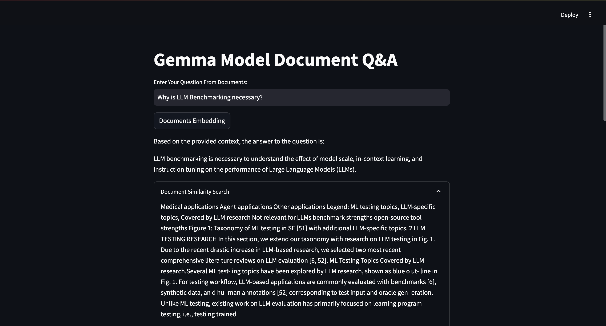

# QnA-RAG-App-with-Gemma-and-Groq-API

This repository hosts the **QnA RAG (Retrieval-Augmented Generation) Application** built using **Gemma** and the **Groq API**. The project leverages Retrieval-Augmented Generation techniques to create a scalable Question-and-Answer application with advanced query-handling capabilities.

---

## 🚀 Features

- **Gemma Integration**: Leverages Gemma for language model-based QnA capabilities.
- **Groq API**: Enables fast, scalable, and efficient retrieval of data.
- **Retrieval-Augmented Generation (RAG)**: Combines the power of retrieval systems with generative models for contextually accurate answers.
- **Interactive UI**: User-friendly interface powered by Python and Streamlit.
- **Scalable Architecture**: Built to handle large datasets and multiple users concurrently.

---

## Preview



---

## 🛠️ Installation

Follow these steps to set up and run the application:

### Prerequisites
- Install **Python 3.8+**.
- Install **Streamlit**.
- Set up access to the **Groq API** and **Gemma API**.

---

### Steps

#### 1. Clone the Repository
```bash
git clone https://github.com/your-username/QnA-RAG-App-with-Gemma-and-Groq-API.git
cd QnA-RAG-App-with-Gemma-and-Groq-API
```

#### 2. Install Dependencies
```bash
pip install -r requirements.txt
```

#### 3. Set Up Environment Variables

- Copy `.env.example` to `.env`:
  ```bash
  cp .env.example .env
  ```

### 4. Run the App

To start the application, run the following command:

```bash
streamlit run src/app.py
```

## ⚙️ Configuration

Update the `.env` file to include the following:

```plaintext
GROQ_API_KEY=your_groq_api_key
GEMMA_API_KEY=your_gemma_api_key
```
---

## 📊 How It Works

1. **Input Query**: Users enter a question in the Streamlit interface.  
2. **Data Retrieval**: The **Groq API** retrieves relevant documents from the dataset.  
3. **Answer Generation**: **Gemma** processes the query along with the retrieved data to generate an accurate response.  
4. **Display Results**: The app displays the final answer and relevant context.  
